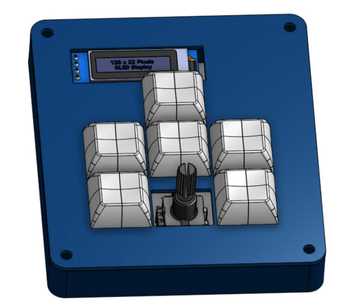
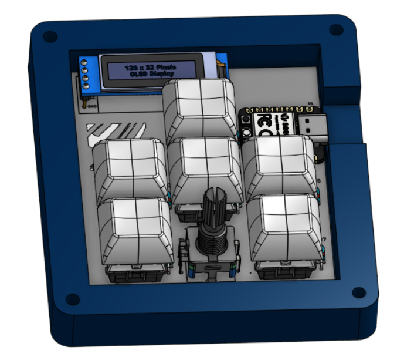
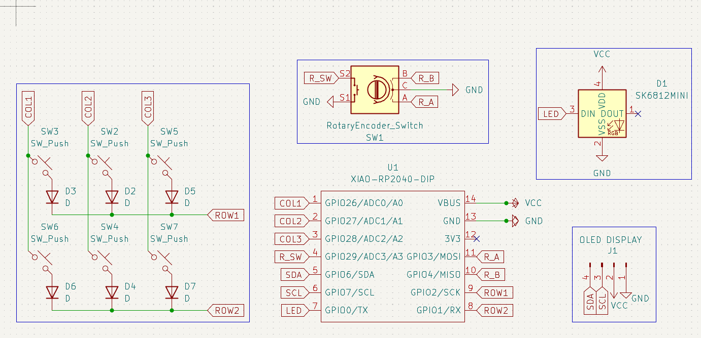
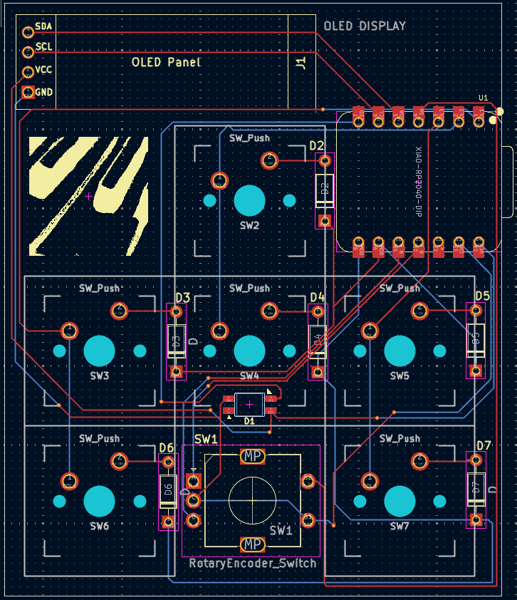
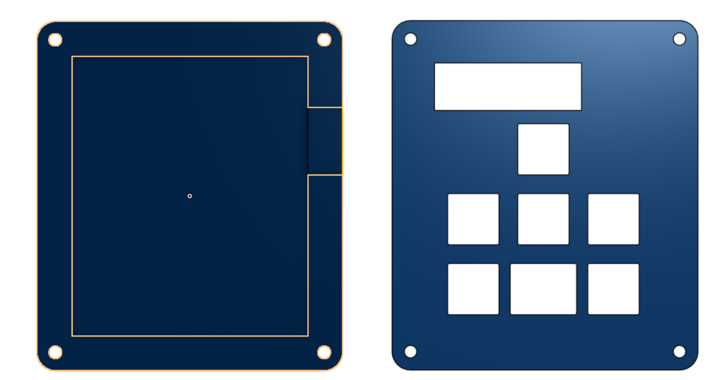

# MacroPad Overview

A 6-key macropad, in an "A" shape, with a 0.91" OLED display and a rotary encoder. It also has one LED under the central key, and everything is controlled with KMK firmware.

This was my first time designing a macropad or any other  electronics with KiCad, and I really enjoyed it (esp. learning more about the wiring). Fortunately, I have some experience with CAD in Onshape, so modeling the case went smoothly.

|          |      |
|----------|------|
|  |  |

## Pictures

| Schematic | PCB | Case |
|:-:|:-:|:-:|
|  |  |  |

**Schematic** and **PCB** designed in _KiCad_. The **CAD** model and whole assembly were designed in _Onshape_ (after trying this process in Fusion 360, I wanted to redesign in Onshape as it felt much more natural and familiar).

## Bill of Materials (BOM)

- 1x XIAO RP2040
- 6x MX-like switches
- 6x DSA keycaps
- 6x through-hole 1N4148 diodes
- 1x SK6812 MINI-E LED
- 1x 0.91" 128x32 OLED display
- 1x EC11E rotary encoder
- 1x case, made of 2 printed parts ([Top.step](production/top.step) and [Bottom.step](production/bottom.step) )
- 4x M3x16mm screws
